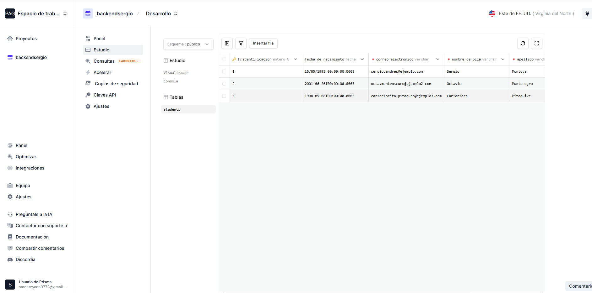
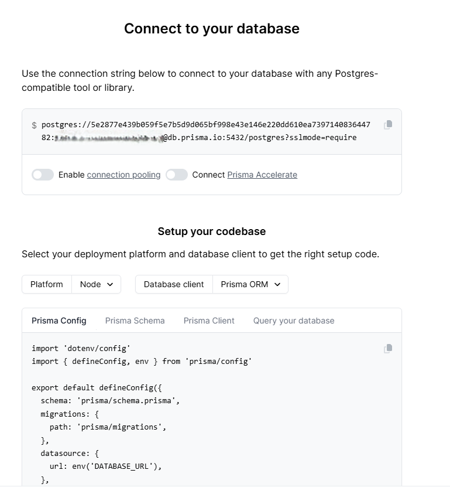

# Actividad 1 - Backend 2 (miercoles) - Cesde

**Nombre completo:**Sergio Andres Montoya Monsalve

# Cuenta de la base de datos creada en prisma.io 

# Configuracion de base de datos en prisma.io 

# Videos de la conexion por consola a la base de datos en  Prisma.io 

[Compilando proyecto](https://youtu.be/KUCehpHGNtY)

[Ejecutando la aplicacion](https://www.youtube.com/watch?v=XoHNg6_kZ9g)

# Evidencias de las pruebas de la api (CRUD)

**POST: crear 3 estudiantes** 

**GET ALL Pruebas de que se guardaron los 3 estudiantes**

  

**Prueba en Prisma**

**GET by ID obteniendo estudiante por su ID**

**GET by Email obteniendo estudiante por email**

**PUT se le actualiza el phone al estudiante 1**

**DELETE : se elimina el estudiante 2**

# Ejecucion de pruebas unitarias y de integracion

[test](https://youtu.be/1ZKsRfA2hCI)

